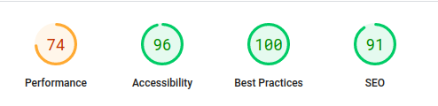
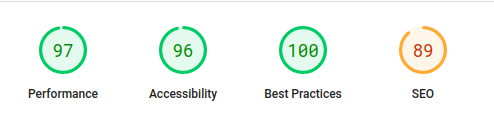

# Nadmuchani 👋

<div style="display: flex;">
  
  
</div>

## IMPORTANT ❗

It is a no longer used version of this site. New site ( with the same address ) is fully based on wordpress.
I've decided to leave this version here because of the work that I've put into this project.

## About 👀


Nadmuchani is a simple website to promote bouncy castles rentals in Poland. It was created for a client who wanted to have a website to promote his business. The website is fully responsive and has a simple design.

Mobile version: yes!

PageSpeed Insights:

- [Mobile](https://pagespeed.web.dev/analysis/https-nadmuchani-com-pl/1neyg3oz43?form_factor=mobile): <br/>
   <br/>
- [Dekstop](https://pagespeed.web.dev/analysis/https-nadmuchani-com-pl/1neyg3oz43?form_factor=desktop): <br/>
  

## How can I try it? 🤔

Try now on: https://nadmuchani.com.pl/ <br/>

## Instalation steps 📋

1. Copy this repository

```
gh repo clone BartoszBuko/nadmuchani
cd ./nadmuchani
```

or

```
git clone https://github.com/BartoszBuko/nadmuchani.git
cd ./nadmuchani
```

2. Install required packages

```
npm install
```

3. Open App in Development mode

```
npm start
```

Open https://localhost:3000 to view in the browser. <br/>
And that's all!

## About UX/UI 🖌️

I made design all by myself


Figma: [click here](https://www.figma.com/file/t3E5WFGAw0TXmWTPXqhBqi/NADMUCHANI?node-id=0%3A1&t=c6fSvr4d8Ue868a0-1) <br>

## Technological facilities 🛠️

- HTML5
- CSS3
- JavaScript (ES6+)

## Used libraries 📚

- [GSAP](https://greensock.com/gsap/)
